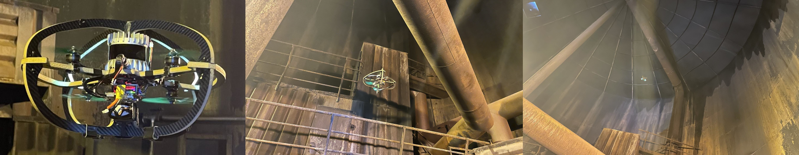

# Relyon Dataset

> [!NOTE]
> The dataset will be released upon publication of the corresponding paper.

This repository contains a dataset collected in a cylindrical tank at [Relyon Nutec Trondheim](https://www.google.com/maps/place/RelyOn+Nutec+Trondheim/@63.4463882,10.3397505,616m/data=!3m1!1e3!4m6!3m5!1s0x466d33cba9d532d7:0x617f9fd3c3a9f084!8m2!3d63.4465!4d10.339551!16s%2Fg%2F1tfbrhzj?entry=ttu).

The dataset was collected using a flying platform with an Ouster OS0-64 Rev. D LiDAR as the main sensor.

Collected in April 2022.



## Bagfile

The dataset is a ROS 1 bagfile available at [this link](#).

The bagfile contains the following topics:

| Topic | Type | Source |
| --- | --- | --- |
| `/os_node/lidar_packets` | `ouster_ros/PacketMsg` | Ouster OS0-64 Rev. D LiDAR |
| `/os_node/imu_packets` | `ouster_ros/PacketMsg` | Ouster OS0-64 Rev. D LiDAR |
| `/mavros/imu/data_raw` | `sensor_msgs/Imu` | Pixracer Pro Autopilot IMU |

## LiDAR Driver

The [official Ouster ROS driver](https://github.com/ouster-lidar/ouster-ros) can be used to convert the packets on the `/os_node` topics to pointclouds and IMU messages. 

To run the driver with the dataset, one may use the command
```bash
roslaunch ouster_ros replay.launch metadata:=metadata.json ouster_ns:=os_node timestamp_mode:=TIME_FROM_ROS_TIME
```
with the `metadata.json` file from this repostory.

## Transforms

The transform between the IMU frame (body) and the LiDAR (os_sensor) is given by the following static transform:

```
frame_id child_frame_id x y z    qx qy qz qw
body     os_sensor      0 0 0.05 0  0  0  1
```

## Acknowledgements

We thank Relyon Nutec Trondheim for access to the facility.